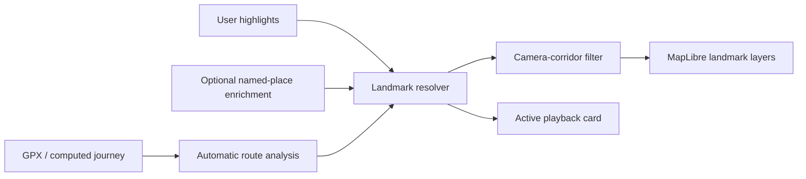

# Route Landmarks Implementation Plan

## Goal

Make replays feel aware of their landscape without covering the map in UI. The
system should support summits, passes, huts, lakes, waterfalls, trailheads,
towns, route milestones, media and user-created story moments.

Landmarks are quiet, terrain-integrated symbols by default. The route marker is
always dominant; an annotation card appears only for an active user highlight.

## Current State

- `useTextAnnotationsLayer.ts` renders authored annotation dots and a large
  active canvas card. It is a playback-story UI, not a subtle landscape layer.
- `RouteAnnotationsEditor.tsx` creates authored points at the current replay
  position.
- MapLibre already renders the route on a DEM-backed 3D terrain scene.

Use native MapLibre GeoJSON/circle/symbol layers for v1. They give collision
handling, zoom expressions and map-pitch alignment. Do not use DOM markers for
landmarks. Literal 3D mesh objects need a custom WebGL/Three.js layer and are a
future enhancement, not a requirement for terrain-feeling labels.

## Data Model

Create `app/src/types/landmarks.ts`.

```ts
export type LandmarkType =
  | 'summit' | 'pass' | 'viewpoint' | 'high-point' | 'waterfall'
  | 'trailhead' | 'hut' | 'shelter' | 'camp' | 'water' | 'aid-station'
  | 'finish' | 'town' | 'lake' | 'river-crossing'
  | 'photo' | 'note' | 'challenge' | 'custom'
  | 'highest-point' | 'longest-climb' | 'major-descent' | 'halfway';

export type LandmarkSource = 'automatic' | 'user' | 'enriched' | 'media';
export type LandmarkDisplay = 'subtle' | 'highlight';

export interface RouteLandmark {
  id: string;
  type: LandmarkType;
  source: LandmarkSource;
  display: LandmarkDisplay;
  lat: number;
  lon: number;
  progress: number | null;
  elevation?: number;
  title: string;
  subtitle?: string;
  importance: 1 | 2 | 3 | 4 | 5;
  routeDistanceMeters?: number;
  metadata?: {
    osmId?: string;
    tags?: Record<string, string>;
    generatedKind?: 'local-maximum' | 'longest-climb' | 'major-descent' | 'halfway';
  };
}
```

Persist user landmarks only. Automatic landmarks are recomputed from the route;
enriched results are disposable cache entries. Keep `TextAnnotation` separate;
add an optional `landmarkId` link later when a user wants a card and a subtle
terrain anchor at the same location.

Create `landmarksSlice.ts` and wire it through `storeTypes.ts` and
`createAppStore.ts`:

- `userLandmarks`, `showLandmarks`, `enabledLandmarkGroups`
- add, update, remove, and filter-setting actions

## Architecture



The resolver deduplicates all inputs. The map layer receives only the selected
visible subset, and updates its source only when that subset changes.

## Phase 1: Automatic Route Moments

Create `app/src/utils/routeLandmarks.ts` with pure functions:

1. Build a distance/progress/elevation profile from `ComputedJourney` or the
   active GPX track.
2. Smooth elevation over physical distance (not GPX-point count) to avoid false
   peaks from GPS altitude noise.
3. Detect local high points using a minimum 100 m prominence, 1.5 km spacing,
   and a four-label cap. Always include the absolute high point.
4. Detect one meaningful sustained climb and one major descent with gain/grade
   thresholds.
5. Add route-independent milestones: halfway for routes >=5 km and finish.

Automatic titles are localized, concise, and data-led: `Highest point`,
`2,379 m`; `Longest climb`, `+820 m`; `Halfway`.

Return no terrain features when elevations are missing or flat. Do not invent
summits from a route line alone.

Create `app/src/utils/resolveRouteLandmarks.ts`:

- merge features within 80 m;
- user landmarks beat automatic, media and enriched metadata;
- cap to one label per 250 m corridor section unless importance is 5;
- priority: active user highlight > finish > selected landmark > highest point
  > named summit/pass > contextual POI.

Create `app/src/hooks/useRouteLandmarks.ts` to memoize analysis, merge user
landmarks, and supply a stable resolved list to `TrailMap.tsx`.

## Phase 2: Terrain Landmark Layer

Create `app/src/components/map/hooks/useRouteLandmarksLayer.ts`.

Use one GeoJSON source and three layers:

1. `route-landmarks-halo`: tiny low-opacity, map-pitch-aligned circle anchoring
   the point to terrain.
2. `route-landmarks-icon`: generated monochrome SVG/SDF icon (14-18 px),
   map-pitch and map-rotation aligned. SDF allows data-driven colors.
3. `route-landmarks-label`: 10-11 px text, viewport-aligned for readability,
   with a dark 1 px halo and `text-optional: true`.

Rendering rules:

- use `symbol-sort-key` from importance and normal collision handling;
- contextual POIs: muted sand/grey at 55-70% opacity;
- terrain features: alpine blue-grey at 70-85% opacity;
- user highlights: their chosen color; active highlight gets the strongest
  anchor plus the existing card, not a permanent oversized map label;
- fade labels below zoom 11; render icon-only when labels collide;
- maximum label text: title plus elevation on a second line for terrain types;
- never use emoji in the map symbol layer.

Create `app/src/utils/landmarkVisibility.ts` to select the visible subset:

- Overview: all importance 4-5 features plus a capped selection of lower ones.
- Follow Behind: candidates within roughly 1.5 screen widths around/ahead of
  the marker.
- Very Close: maximum three labels and six icons; keep landmarks for a 2-second
  hysteresis window to prevent popping during turns.
- Export: filtering depends only on replay progress, never wall-clock time.

## Phase 3: User Highlights and Media

Create `RouteLandmarksEditor.tsx` in the existing annotation/media panel.

- Add a marker at current replay position.
- Select type, title, subtitle, and color for custom story types.
- Show generated route moments read-only in a separate section.
- Selecting a landmark seeks to it and temporarily promotes it to the active
  annotation-card flow.
- Let existing text annotations opt into “Also show as terrain landmark” rather
  than silently migrating every card.

Pictures/videos with route coordinates derive low-priority `photo` landmarks
when media visibility is enabled, without replacing their current interaction.

Add project persistence/import-export support for user landmarks and ensure
video capture waits for the landmark source/layers to be initialized.

## Phase 4: Optional Named-Place Enrichment

This must be explicit opt-in. It is valuable for named peaks, passes, huts,
waterfalls, viewpoints, lakes, trailheads and towns, but must not send every
route to a third party by default.

Add a Cloudflare Pages Function:

- `functions/api/landmarks.js`

Client behavior:

- user enables “Nearby places and landmarks”;
- client sends a simplified, bounded route corridor, not raw GPX;
- results become `source: 'enriched'` landmarks and flow through the same
  resolver and layer.

Function behavior:

- validate corridor area, route length and payload size;
- query/cache OpenStreetMap-derived features for peaks, passes, huts, shelters,
  viewpoints, waterfalls, water, places and trailheads;
- normalize tags to `LandmarkType`;
- cache using rounded corridor tiles and implementation version;
- cap raw results at 100 and selected results at 24;
- include required OSM attribution data;
- never run during playback/export frames.

Create `landmarkCorridor.ts` to simplify the path, project returned POIs to the
route via `routeProjection.ts`, reject distant POIs, and rank results by type,
name, route distance and importance. Allow users to hide a suggested place and
persist dismissals by OSM id.

## Tests

- `routeLandmarks.test.ts`: noisy altitude, absolute high point, peak spacing,
  flat/missing elevation, climb/descent thresholds.
- `resolveRouteLandmarks.test.ts`: merge distance and source/importance rules.
- `landmarkVisibility.test.ts`: close-camera caps, ranking, hysteresis inputs.
- `landmarkCorridor.test.ts`: simplification, route projection and POI ranking.
- function tests: input validation, response caps and cache-key behavior.
- MapLibre hook tests with mocked map APIs for source/layer creation and cleanup.

## Performance Budget

| Metric | Target |
| --- | --- |
| Resolved landmarks per route | <= 40 |
| Visible icons in close replay | <= 6 |
| Visible labels in close replay | <= 3 |
| New MapLibre layers | 3 + one GeoJSON source |
| Per-frame allocations | none |
| Enrichment calls by default | 0 |

Profile the feature using the UTMB GPX at Follow Behind -> Very Close, 3D terrain
enabled, at 4x and 8x. Compare frame time and tile diagnostics with landmarks
off/on. Lower visible-label caps before adding richer visuals if replay smoothness
changes.

## Future Physical 3D Objects

Only after the symbol-layer version succeeds: a custom MapLibre WebGL/Three.js
layer may show up to three local low-poly objects (for example, a summit flag or
hut silhouette) placed at terrain elevation. It must have no playback-time
network fetches, be feature-flagged, and fall back to the normal symbol layer.

## Rollout and Acceptance Criteria

1. Ship types, automatic analysis, resolver, tests.
2. Ship the subtle layer behind a local feature flag; validate UTMB performance.
3. Add editor, annotation/media links, persistence and export verification.
4. Enable automatic/user landmarks by default with a View-panel toggle.
5. Add the opt-in cached named-place enrichment service.

The release is ready when a mountain GPX shows only a handful of meaningful
terrain moments; a flat GPX remains uncluttered; the marker remains dominant in
Very Close; user highlights can be created/edited/hidden; no POI request occurs
without consent; and the UTMB replay remains at baseline camera/tile quality.
